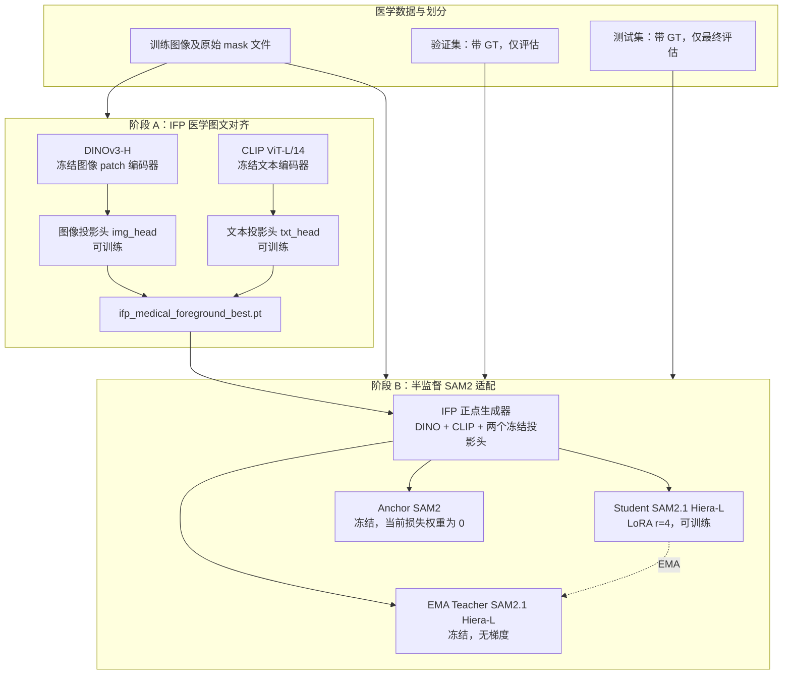
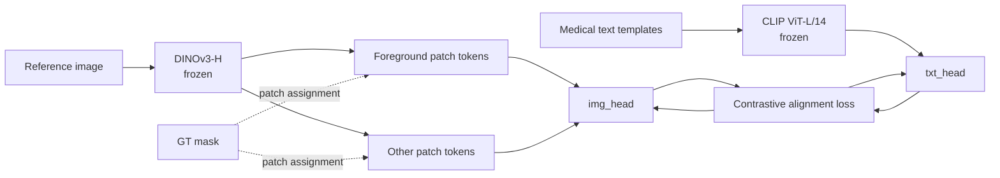
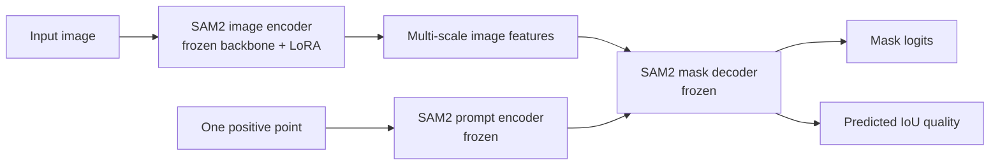
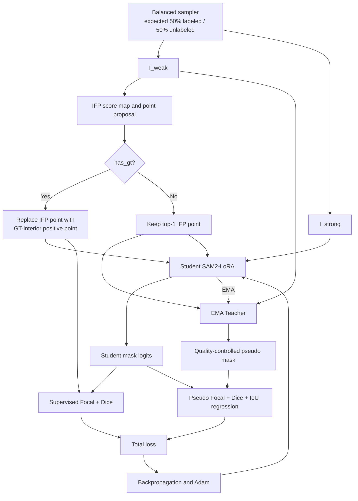

# IFP-WeSAM 半监督医学分割：项目架构与科研绘图说明

> 文档用途：为论文方法图、系统架构图、训练流程图、消融图和答辩图提供准确的模块关系与数据流说明。
> 对应代码状态：当前 `wesam2` 主流程（2026-07-27）。
> 推荐训练入口：`run_semisup_manifest.py`（ISIC / 单个 Kvasir）与 `run_polyp_manifest.py`（Kvasir + CVC-ClinicDB 联合训练及多数据集测试）。

---

## 1. 一句话定义

本项目是一个**由图文对齐提示驱动的半监督 SAM2-LoRA 医学图像分割框架**：

1. 用少量真实标注训练轻量 IFP 图文投影头；
2. IFP 通过 DINO patch 与 CLIP 文本的相似度，在每张图中定位目标内部的正点；
3. Student SAM2 用该提示点学习分割；
4. 对有标注样本使用完整真实 mask 监督；
5. 对无标注样本由 EMA Teacher SAM2 产生经严格筛选的伪 mask；
6. 仅更新 Student 的 LoRA 参数，并将其用 EMA 更新到 Teacher；
7. 用验证集 mIoU 选择历史最优的 **Student** 权重，最后仅对独立测试集评估一次。

**必须在图中表达的核心贡献链：**

```text
少量 GT mask
  ├─> 学习 IFP 投影头 ─> 文本引导的目标内提示点
  └─> 真实监督 ─> Student SAM2-LoRA

无标签图像 ─> EMA Teacher + IFP 点 ─> 高置信伪标签 ─> Student SAM2-LoRA
                                                               │
                                                               └─ EMA 更新 Teacher
```

这里 IFP 的输出始终是**点提示（point prompt）**，不是分割 mask；真正输出 mask 的网络是 SAM2。

---

## 2. 系统边界、输入与输出

### 2.1 系统级模块



### 2.2 本地基础模型与训练产物

| 类别 | 位置 / 文件 | 训练时是否更新 | 在方法图中的角色 |
| --- | --- | --- | --- |
| DINOv3-H | `assets/DINO/dinov3/` | 否 | 将图像转为稠密 patch token |
| CLIP ViT-L/14 | `assets/CLIP/clip-vit-large-patch14/` | 否 | 将类别文本转为文本语义特征 |
| SAM2.1 Hiera-L | `checkpoints/sam2.1_hiera_large.pt` | 基座冻结 | 提示驱动 mask 解码器 |
| IFP 前景投影头 | `ifp_medical_foreground_best.pt` | 仅阶段 A 更新 | 将 DINO / CLIP 特征映射到共同对齐空间 |
| Student checkpoint | `save/best-student.pth` | 阶段 B 产物 | 最终报告与测试使用的模型 |
| Teacher | 内存中的 EMA 副本 | 无反向传播 | 为无标签样本生成伪标签 |
| Anchor | 初始化时复制的冻结 SAM2 | 无反向传播 | 保留的兼容模块，当前不贡献训练梯度 |

### 2.3 不应画错的事实

| 容易误画的说法 | 当前项目中的正确表达 |
| --- | --- |
| IFP 直接产生 pseudo mask | IFP 仅产生点和 patch 分数；Teacher SAM2 产生 pseudo mask。 |
| Teacher 通过 loss 反向传播训练 | Teacher 无梯度；仅由 Student 的 EMA 更新。 |
| 全部 SAM2 参数微调 | SAM2 基座冻结，仅对 Hiera 图像编码器注意力 Q、V 分支插入 LoRA，秩为 4。 |
| 有 GT 的样本也用伪标签 | 有 GT 样本只用真实 mask 计算监督损失。 |
| 每个 batch 严格 50% GT | 当前是有放回加权随机采样，长期期望 50%，单个 batch 不保证严格各半。 |
| 当前采用多轮 mask 并集 | 代码具备多轮能力，但当前实验配置 `max_iters=1`，所以每张无标签图只接受一个 Teacher mask，不做并集。 |
| 最后保存 EMA Teacher | 当前只依据 Student 验证 mIoU 保存 `best-student.pth`。 |

---

## 3. 数据协议与半监督标签定义

### 3.1 三个不重叠的数据用途

```text
完整数据集
├─ train.csv
│  ├─ 固定随机种子选出的少量 labeled subset（1% 或 10%）
│  │  ├─ 训练 IFP 前景投影头
│  │  └─ 在 Student 训练中提供真实 mask 监督
│  └─ unlabeled subset
│     └─ 不向优化器暴露 GT，仅由 Teacher 产生伪标签
├─ validation.csv
│  └─ 每个 epoch 评估 Student，选择 best-student.pth
└─ test.csv
   └─ 训练结束后重载 best-student.pth，最终评估一次
```

虽然所有训练图在磁盘上都有原始 mask 文件以便数据读取，但 `has_gt` 布尔标记决定该 mask 是否能进入训练 loss。对逻辑上的无标签样本，代码不会使用其 GT mask 监督 Student。

### 3.2 固定 labeled subset

对训练清单长度为 `N_train` 的数据集，给定 `labeled_ratio r` 和随机种子 `seed`：

```text
N_labeled = round(N_train × r)
labeled_indices = Random(seed).sample(range(N_train), N_labeled)
```

同一次实验中，labeled subset 固定不变。`r=0.01` 和 `r=0.10` 分别表示 1% 与 10% 的真实标注预算，而不是每轮重新抽取不同的 GT 图。

### 3.3 50% 平衡采样的精确定义

训练集使用 `WeightedRandomSampler(replacement=True)`。若当前有 `L` 张 labeled 图和 `U` 张 unlabeled 图，则每一张图的抽样权重为：

```text
w_labeled   = 0.5 / L
w_unlabeled = 0.5 / U
```

因此，任意一次抽样落在 labeled 集合的总概率为 0.5，落在 unlabeled 集合的总概率也为 0.5。它解决了 1% GT 时真实监督极少的问题：小 labeled 集会被重复抽取，使真实监督不会被伪标签更新淹没。

对 `batch_size=4`，一个 batch 中 GT 样本数服从二项分布 `Binomial(4, 0.5)`：

| GT 图数量 | 概率 |
| ---: | ---: |
| 0 | 6.25% |
| 1 | 25.00% |
| 2 | 37.50% |
| 3 | 25.00% |
| 4 | 6.25% |

所以图中应标为“**balanced sampling, expected 50% labeled**”，不要画成每个 batch 强制的 `2 GT + 2 unlabeled`。

---

## 4. 阶段 A：医学 IFP 图文对齐投影头训练

### 4.1 目的

预训练 DINO 与通用 CLIP 不直接针对皮肤病灶或息肉前景。阶段 A 只学习两个很小的投影头，使目标区域的 DINO patch 特征与类别文本特征在共同空间内更接近，从而输出更可靠的 SAM2 正点。

### 4.2 输入

对每一张 labeled reference image：

```text
参考图像 I_ref + 真实前景 mask M_ref + 目标类别文本 T
```

典型文本模板：

| 数据域 | 前景文本 |
| --- | --- |
| ISIC | `a dermoscopic photo of a skin lesion` |
| Polyp / Kvasir | `a colonoscopy image of a polyp`；`an endoscopic view showing a colorectal polyp` |

多条同义文本均经 CLIP 编码后，在投影空间取均值，减少单个 prompt 措辞的敏感性。

### 4.3 特征提取与 patch 标签构造

当前默认是 `dino3h`：

```text
输入图像
  -> resize 到 512 × 512
  -> DINOv3-H，patch size = 16
  -> 32 × 32 = 1024 个 patch token
```

GT mask 同样映射到 `32 × 32` patch 网格。与前景区域有覆盖的 patch 是 positive patch，其余是 other / negative patch。每张参考图分别计算：

```text
f+ = mean(positive patch tokens)
f- = mean(other patch tokens)
t  = mean(CLIP text features of all templates)
```

### 4.4 可训练投影头与损失

两个投影头均为两层 MLP：

```text
Linear -> ReLU -> Linear -> L2 normalization
```

令 `h_img(·)` 为 image projection head，`h_txt(·)` 为 text projection head，余弦相似度为 `cos(·,·)`，间隔为 `m=0.3`。每个 batch 的对齐目标为：

```text
L_positive   = 1 - mean(cos(h_img(f+), h_txt(t)))
L_negative   = ReLU(mean(cos(h_img(f-), h_txt(t))) + m)
L_separation = ReLU(mean(cos(h_img(f+), h_img(f-))) + m)

L_IFP = L_positive + L_negative + 0.5 × L_separation
```

训练的只有 `img_head` 和 `txt_head`；DINO 与 CLIP 在整个阶段保持冻结。按最低 `L_IFP` 保存：

```text
ifp_alignment/ifp_medical_foreground_best.pt
```

### 4.5 可用于论文子图的结构



建议在图中将 DINO / CLIP 画成灰色并标记 `Frozen`，两个 projection heads 用强调色并标记 `Trainable only in Stage A`。

---

## 5. 阶段 B 的提示生成：IFP 从文本到 SAM2 正点

### 5.1 运行时 IFP 模块

训练和验证时，`IFPPointPromptGenerator` 加载：

```text
冻结 DINOv3-H
冻结 CLIP ViT-L/14
冻结 img_head
冻结 txt_head
前景文本 embedding
```

对于任一输入图 `I`：

```text
I -> DINO -> patch tokens z_i, i = 1 ... 1024
z_i -> img_head -> p_i
text templates -> CLIP -> raw text features -> txt_head -> q
score_i = cosine_similarity(p_i, q)
```

选择最高分 patch：

```text
i* = argmax_i score_i
```

若 patch 网格尺寸是 `H_g × W_g`，图像尺寸是 `H × W`，选中索引对应的行列为 `(r, c)`，其中心点坐标为：

```text
x = (c + 0.5) × W / W_g
y = (r + 0.5) × H / H_g
```

当前固定使用：

```text
max_positive_points = 1
min_positive_points = 1
include_box = False
```

即每张图只有**一个 IFP 正点**，没有框提示。此点应在方法图中以绿色实心圆表示，并明确标记为 `positive point`。

### 5.2 有 GT 与无 GT 样本的提示差异

| 样本类型 | 最终交给 SAM2 的点 | 原因 |
| --- | --- | --- |
| labeled 图像 | 从 GT mask 内部选取的单一正点 | 让真实监督阶段使用高质量、目标内部的 oracle point。 |
| unlabeled 图像 | IFP 最高文本相似度 patch 的中心点 | 部署时没有 GT，必须由图文对齐定位。 |
| 验证 / 测试图像 | IFP 最高文本相似度 patch 的中心点 | 保持真实部署条件；评估不读取 GT 生成 prompt。 |

GT 内部点的构造方式：先对真 mask 做 `7 × 7` 腐蚀，优先选择侵蚀后区域内、距离候选点均值最近的像素；若目标过小导致腐蚀区域为空，则退回整个前景 mask。这样点尽量远离边界。

**科研图含义：**

```text
labeled branch:      GT mask -> interior positive point -> Student
unlabeled/test branch: image + text -> IFP heatmap -> max-score point -> SAM2
```

---

## 6. Student、Teacher、Anchor 的模型关系

### 6.1 初始化

```text
预训练 SAM2.1 Hiera-L checkpoint
        │ deep copy
        ├────────────> Student SAM2 + LoRA
        ├────────────> EMA Teacher SAM2 + LoRA
        └────────────> Anchor SAM2 + LoRA
```

三个模型初始化权重相同。之后：

| 模型 | 梯度 | 参数更新来源 | 用途 |
| --- | --- | --- | --- |
| Student | 有 | Adam + 学习率调度器 | 产生训练预测、最终保存 |
| Teacher | 无 | `Teacher <- EMA(Student)` | 无标签伪标签 |
| Anchor | 无 | 从初始化后不再更新 | 可选稳定约束 |

### 6.2 SAM2-LoRA 的可训练位置

SAM2 的 image encoder、prompt encoder、mask decoder 原始参数都冻结。LoRA 以 rank `r=4` 注入 Hiera image encoder 每个 trunk attention block 的 Q 与 V 投影：

```text
original qkv(x)
    + B_q(A_q(x))  inserted into Q channels
    + B_v(A_v(x))  inserted into V channels
```

其中：

```text
A_q, A_v: d -> 4
B_q, B_v: 4 -> d_out
```

因此，应把 Student 画成“Frozen SAM2 backbone + Trainable LoRA adapters”，而不是整个 SAM2 都被微调。

### 6.3 编码器与解码器数据流



`mask logits` 在训练损失中直接使用；需要二值 mask 时，当前训练中的伪标签和 IoU 回归目标以 `logits > 0` 作为前景判定。

---

## 7. 每个训练 batch 的完整数据流

### 7.1 弱增强与强增强

每张训练图生成两个视图：

```text
原图
  -> weak augmentation: horizontal / vertical flip
  -> I_weak
  -> strong photometric augmentation: posterize, equalize, sharpen,
                                    solarize, brightness/contrast, shadow
  -> I_strong
```

强增强只在弱增强图上施加光度变换，不再改变几何位置。因此，弱视图中生成的点和伪 mask 可以直接作为强视图 Student 的监督目标。

### 7.2 单个 batch 的总图



注意：图中 Teacher 只有无标签分支；有 GT 样本不会进入伪标签 loss。实现为了兼容 Anchor 模块，对包含无标签的 batch 也会运行 Anchor 前向，但当前 `anchor_weight=0`，其输出不影响 `Total loss`。

---

## 8. labeled 分支：真实 mask 监督

对 batch 内第 `i` 张 labeled 图：

```text
GT mask M_i
  -> GT-interior point p_i
  -> Student(I_strong_i, p_i)
  -> predicted logits Z_i
  -> compare against complete GT mask M_i
```

若一张图有多个实例，先将所有实例 mask 求并集，得到单一二值前景 mask：

```text
M_i = union(all instance masks)
```

监督损失为：

```text
L_sup = mean_labeled [ L_focal(Z_i, M_i) + L_dice(Z_i, M_i) ]
```

这一分支：

- 使用完整 GT mask，而不是只有点监督；
- 不读取 Teacher mask；
- 不计算 Anchor / contrast loss；
- 始终以权重 `supervised_weight = 1.0` 进入总 loss。

---

## 9. unlabeled 分支：EMA Teacher 的高置信伪标签

### 9.1 Teacher 伪标签产生

当前生产配置是单轮：

```text
IFP top-1 point + I_weak
      -> EMA Teacher SAM2
      -> teacher mask logits Z_T
      -> binary candidate mask M_T = [Z_T > 0]
      -> quality and geometry filtering
      -> accepted pseudo label or empty mask
```

Teacher 还输出一个模型内部的 `predicted IoU` 标量。它是 SAM2 对当前 mask 质量的预测，不是通过无标签 GT 实际计算的 IoU。

### 9.2 伪标签质量门控

候选 mask 必须依次通过以下条件：

| 门控条件 | 当前值 | 含义 |
| --- | ---: | --- |
| Teacher predicted IoU | `>= 0.8` | 只接收 Teacher 自评为高质量的 mask。 |
| 非空 | `area > 0` | 排除空预测。 |
| 最大面积 | `area / image_area <= 0.6` | 排除覆盖超过 60% 图像的异常大 mask。 |
| 最小新像素数 | `>= 32` | 排除过小或重复的候选。 |
| 最小新增面积比例 | `>= 0.001 × image_area` | 与固定最小像素数共同决定新增阈值。 |

### 9.3 代码具备、但当前未激活的多轮扩展

`iterative_teacher_pseudo_labels` 支持如下多轮策略：

```text
repeat until max_iters:
    choose current highest IFP-score patch
    Teacher decodes one candidate mask from cached image embedding
    filter candidate
    accepted candidate -> union into pseudo mask
    suppress patches covered by accepted mask
```

第 2 轮及以后还会检查：

| 参数 | 当前值 | 多轮时的作用 |
| --- | ---: | --- |
| `min_overlap_ratio` | 0.7 | 新候选大部分须落在已接受区域内。 |
| `max_new_area_ratio` | 0.4 | 相对已有 union，新增面积不能过大。 |

但当前：

```text
max_iters = 1
```

所以当前真实运行中不会触发“union、patch suppression、后续候选 overlap”这些步骤。论文主图应画为**单个高置信 Teacher mask**；若展示方法的可扩展版本，可将多轮选择画成虚线 optional block，并标记 `not enabled in reported configuration`。

### 9.4 unlabeled 损失

只对通过上述筛选的有效伪 mask 计算：

```text
L_teacher = mean_valid_pseudo [
    L_focal(Z_S, M_T)
  + L_dice(Z_S, M_T)
  + 0.1 × MSE(q_S, IoU_binary(Z_S, M_T))
]
```

其中：

- `Z_S`：Student 在强增强图上的 mask logits；
- `M_T`：Teacher 在弱增强图上的二值伪 mask；
- `q_S`：Student 的 IoU quality prediction；
- `IoU_binary`：Student 二值 mask 与 Teacher pseudo mask 的实际二值 IoU，仅用于训练 Student 的质量预测头。

若某一无标签图没有通过筛选的伪标签，它不贡献 `L_teacher`；若一个 batch 没有有效伪标签，则该 batch 的伪标签项为零。

---

## 10. 总损失、优化与 EMA 更新

### 10.1 当前启用的总损失

令：

```text
R(e) = min(1, epoch / 3)
```

为无监督项的 warm-up 系数。当前总损失为：

```text
L_total = 1.0 × L_sup + R(e) × 0.1 × L_teacher
```

展开后，伪标签项的最终有效系数为：

```text
R(e) × 0.1 × [Focal + Dice + 0.1 × IoU_regression]
```

该设计的目的不是让伪标签主导更新，而是以真实监督为稳定锚点，用少量可靠伪标签扩大无标签数据覆盖。

### 10.2 当前关闭的项

完整实现的形式是：

```text
L_total = L_sup
        + R(e) × teacher_weight × L_teacher
        + R(e) × anchor_weight × L_anchor
        + R(e) × contrast_weight × L_contrast
```

但当前配置：

```text
teacher_weight  = 0.1
anchor_weight   = 0.0
contrast_weight = 0.0
supervised_weight = 1.0
```

因此 Anchor Dice loss 与特征 contrast loss 虽仍保留于代码，均不会对 Student 产生梯度。科研主图不应把它们画为当前训练的有效 loss；若需要展示原 WeSAM 的兼容结构，应使用灰色虚线并标 `weight = 0`。

### 10.3 Student 更新与 Teacher EMA

每个 iteration 的参数更新顺序：

```text
1. Student forward
2. calculate L_total
3. backpropagate L_total
4. Adam updates Student LoRA parameters
5. Teacher <- 0.999 × Teacher + 0.001 × Student
6. learning-rate scheduler step
```

EMA 公式为：

```text
theta_teacher^(t+1)
  = 0.999 × theta_teacher^(t)
  + 0.001 × theta_student^(t+1)
```

Teacher 的权重是 Student 历史权重的平滑平均，故其伪标签在时间上通常更稳定，但并不意味着 Teacher 一定比 Student 有更高的验证 mIoU。

### 10.4 优化器与学习率

| 项目 | 当前值 |
| --- | ---: |
| 优化器 | Adam |
| learning rate | `1e-4` |
| weight decay | `1e-4` |
| warm-up steps | 250 |
| LoRA rank | 4 |
| EMA rate | 0.999 |
| epoch 数 | 默认 10 |

---

## 11. 验证、checkpoint 选择与最终测试

### 11.1 Epoch 0 基线

模型初始化后，项目会先用未适配的冻结副本在验证集跑一次：

```text
SAM2 pretrained + inserted but untrained LoRA
  + IFP-generated test-time point
  -> validation mIoU / F1 at epoch 0
```

这个数值表示训练更新前的基线性能，不是第一个训练 epoch 的结果。

### 11.2 每轮验证与最佳权重

每个 epoch 结束后：

```text
validation image
  -> IFP top-1 point
  -> current Student
  -> mask logits
  -> binary segmentation metrics against validation GT
```

当前仅评估 Student，使用验证集的 mean IoU 作为模型选择指标：

```text
if current_student_mIoU > historical_best_mIoU:
    save best-student.pth
```

checkpoint 中包含：

```text
model
source_model = "student"
epoch
mean_iou
mean_f1
optimizer
```

当前不保存 `best-teacher.pth` 或 `best-overall.pth`。

### 11.3 指标

对每张图计算二值分割混淆矩阵：

```text
IoU = TP / (TP + FP + FN)
F1  = 2TP / (2TP + FP + FN)
```

然后做逐图平均。验证流程使用 `segmentation_models_pytorch` 的 binary metrics。

**实现注意事项：** 当前常规验证函数先执行 `sigmoid(mask_logits) >= 0.5`，等价于 raw `mask logits >= 0.0`；训练伪标签二值化和 IoU regression 同样使用 `logits > 0`。因此，科研报告中应明确写出评估二值化阈值，并在不同实验之间保持同一阈值。若对历史结果做阈值修正，应在新的独立目录重评估，不应覆盖原始 `metrics.csv`。

### 11.4 最终测试

ISIC / 单 Kvasir 入口在训练结束后自动：

```text
reload best-student.pth
  -> switch dataset list from validation.csv to test.csv
  -> final test evaluation
```

Polyp 联合训练入口则在训练结束后重载相同 `best-student.pth`，分别导出并评估：

```text
Kvasir
CVC-ClinicDB
CVC-ColonDB
CVC-300
ETIS-LaribPolypDB
```

用于最终结果的测试集不参与反向传播，也不参与 checkpoint 选择。

---

## 12. 训练与推理流程的差异

| 环节 | 是否需要 GT mask | prompt 来源 | Teacher 是否参与 | 是否更新参数 |
| --- | --- | --- | --- | --- |
| IFP 对齐训练 | 是 | GT patch 标记仅用于训练投影头 | 否 | 仅 img_head / txt_head |
| labeled Student 训练 | 是 | GT interior point | 否 | Student LoRA |
| unlabeled Student 训练 | 否（逻辑上隐藏） | IFP top-1 point | 是，生成 pseudo label | Student LoRA |
| 验证 | 仅用于计算指标 | IFP top-1 point | 否 | 否 |
| 最终测试 | 仅用于计算指标 | IFP top-1 point | 否 | 否 |
| 临床/真实部署 | 否 | IFP top-1 point | 否 | 否 |

这张表适合放在论文方法图旁边，说明模型在验证、测试和部署时并不依赖真实 mask 来生成提示点。

---

## 13. 推荐的论文主图布局

### 13.1 四栏横向方法图

```text
Panel A                     Panel B                    Panel C                         Panel D
Data protocol               IFP point proposal         Semi-supervised adaptation      Evaluation
────────────                ─────────────────          ─────────────────────────       ──────────
Train / Val / Test          Image -> DINO patches      Labeled: GT point + GT mask     Validation mIoU
1% or 10% GT selection      Text -> CLIP embedding     Unlabeled: Teacher pseudo mask  -> best Student
Balanced sampling           Projection heads           Student LoRA <- losses           -> final test
```

### 13.2 可直接给绘图人员的元素清单

| 图元 | 标签建议 | 颜色 / 线型 |
| --- | --- | --- |
| 医学图像 | `Labeled image` / `Unlabeled image` | 常规彩色图像缩略图 |
| GT mask | `Ground-truth mask` | 蓝色实心 mask |
| IFP heatmap | `Text-to-patch similarity` | 黄红热图 |
| 正点 | `IFP point` 或 `GT-interior point` | 绿色实心圆 |
| DINO / CLIP / SAM2 base | `Frozen` | 灰色模块 |
| img_head / txt_head | `Trainable in Stage A` | 橙色模块 |
| Student LoRA | `Trainable LoRA` | 红色或橙色边框 |
| Teacher | `EMA Teacher, stop-gradient` | 蓝色模块，虚线输入输出 |
| 伪 mask | `Accepted pseudo label` | 紫色半透明 mask |
| 反向传播 | `Backpropagation` | 红色实线箭头 |
| EMA | `EMA, m=0.999` | 蓝色虚线箭头 |
| Anchor | `Optional, weight=0` | 灰色虚线；也可从主图省略 |

### 13.3 箭头语义

```text
solid black arrow    = forward data / feature flow
red backward arrow   = gradient and optimizer update
blue dashed arrow    = EMA parameter update
gray dashed module   = present in code but disabled in reported configuration
```

### 13.4 建议放在主图中的数学标注

```text
s_i = cos(img_head(DINO_patch_i), txt_head(CLIP_text))
p*  = center(argmax_i s_i)

L = L_sup + R(e) × 0.1 × L_teacher
theta_T <- 0.999 theta_T + 0.001 theta_S
```

这些式子已经足够表达方法要点；不建议在主图中堆叠实现层面的 `min_new_pixels` 等全部门控参数，可将其放入伪标签过滤子图或补充材料。

---

## 14. 当前报告配置速查表

| 配置项 | 当前值 | 对方法含义 |
| --- | ---: | --- |
| `labeled_ratio` | 0.01 或 0.10 | 训练集中暴露 GT 的比例 |
| `labeled_batch_probability` | 0.5 | 每次采样落入 GT 子集的期望概率 |
| `batch_size` | 常用 4 | 每 batch 的图像数量，不保证 2:2 |
| `dino_variant` | `dino3h` | DINOv3-H 图像 patch 编码器 |
| `clip_variant` | `clipl` | CLIP ViT-L/14 文本编码器 |
| IFP resize | 512 | DINO 输入边长 |
| DINO patch size | 16 | 512 下对应 32 x 32 patch grid |
| positive point count | 1 | 单点提示分割 |
| LoRA rank | 4 | 低秩适配容量 |
| `teacher_iou_threshold` | 0.8 | Teacher 伪标签的预测质量门槛 |
| `max_mask_area_ratio` | 0.6 | 伪标签最大面积约束 |
| `max_iters` | 1 | 当前不进行多轮 pseudo-mask union |
| `teacher_weight` | 0.1 | 伪标签损失权重 |
| `anchor_weight` | 0.0 | Anchor 不参与当前优化 |
| `contrast_weight` | 0.0 | Contrast 不参与当前优化 |
| unsupervised ramp-up | 3 epochs | 前三轮逐步增加无监督项 |
| `ema_rate` | 0.999 | Teacher 的 EMA 平滑系数 |
| model selection | Student validation mIoU | 保存 `best-student.pth` |

---

## 15. 代码到架构模块的映射

| 架构单元 | 实现文件 | 关键职责 |
| --- | --- | --- |
| 实验划分与启动 | `run_semisup_manifest.py` | ISIC / Kvasir：切 train / val / test、选 GT 子集、训练 IFP head、启动训练 |
| Polyp 联合协议 | `run_polyp_manifest.py` | Kvasir + CVC-ClinicDB 联合训练，并跨五个 polyp 测试集导出 |
| IFP head 训练 | `ifp_alignment/train_medical.py` | GT patch 标签、图文投影头、alignment loss |
| DINO / CLIP 加载 | `ifp_alignment/common.py` | 冻结 backbone、patch token、文本特征、projection head |
| IFP 提示与伪标签 | `ifp_alignment/prompt_generator.py` | patch score、点坐标、Teacher 伪 mask 筛选与可选多轮策略 |
| 半监督训练 | `adaptation.py` | GT 分支、伪标签分支、loss、EMA、验证和 checkpoint |
| SAM2-LoRA 封装 | `model.py`、`sam_lora.py` | 图像编码、点提示解码、LoRA 注入 |
| GT / 无标签平衡采样 | `datasets/ISIC.py` | 固定 labeled subset 与 WeightedRandomSampler |
| 数据增强 | `datasets/augmentation.py`、`datasets/tools.py` | weak / strong view 和 resize-pad |
| 验证指标 | `utils/eval_utils.py` | 二值 mIoU、F1、CSV 记录 |
| 独立测试 mask 导出 | `export_test_predictions.py` | 重载 best Student、保存预测 mask 与测试摘要 |

---

## 16. 可报告结论与应避免的过度表述

### 可以准确表述

1. 方法将**少量 mask 标注同时用于图文提示对齐和分割监督**。
2. IFP 将类文本转换为图像内的**语义正点定位**，弥补纯 SAM2 缺少类别指向的问题。
3. Student 在真实监督与高置信 pseudo supervision 的共同约束下进行 LoRA 域适配。
4. EMA Teacher 降低了单一步 Student 波动对伪标签质量的影响。
5. 严格单轮质量筛选和低伪标签权重用于抑制噪声累积。
6. 使用独立测试集评估重载的验证最优 Student checkpoint。

### 不应直接表述

1. “Teacher 一定优于 Student”：EMA 往往更平滑，但当前方法没有用 Teacher 选最终模型。
2. “所有无标签图都有伪标签”：不满足高置信条件的无标签图不产生 teacher loss。
3. “多轮 IFP-SAM mask union 是当前结果的来源”：当前 `max_iters=1`。
4. “每个 batch 严格一半 GT”：当前是概率意义上的平衡采样。
5. “验证集从未影响模型选择”：验证集不参与梯度，但每轮被查看并用于选择最佳 checkpoint，因此正式论文仍应用独立测试集报告最终泛化结果。

---

## 17. 最简科研图叙事

若版面只允许一张简图，可用以下叙事：

```text
Few labeled masks
   ├──> IFP image-text alignment heads ──> semantic positive point
   └──> GT-supervised Student SAM2-LoRA

Unlabeled images + semantic positive point
   ──> EMA Teacher SAM2 ──> confidence-filtered pseudo mask
   ──> Student SAM2-LoRA

Student update ──EMA──> Teacher
Validation mIoU ──select──> best Student ──> final test
```

这张简图必须同时保留四个辨识度最高的元素：`IFP semantic point`、`GT / pseudo 双分支`、`Student-to-Teacher EMA`、`best Student final test`。
